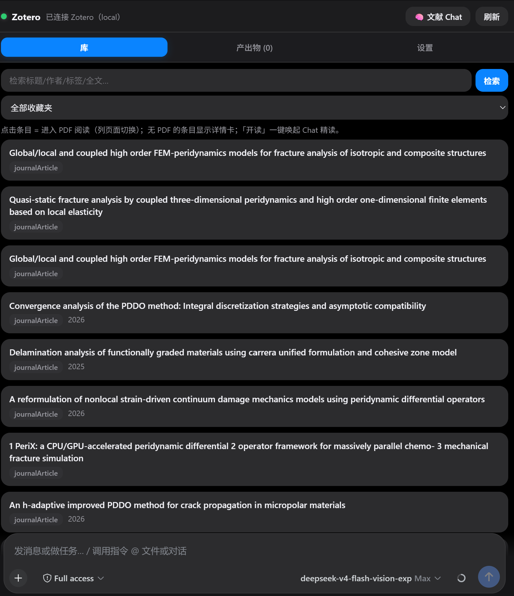
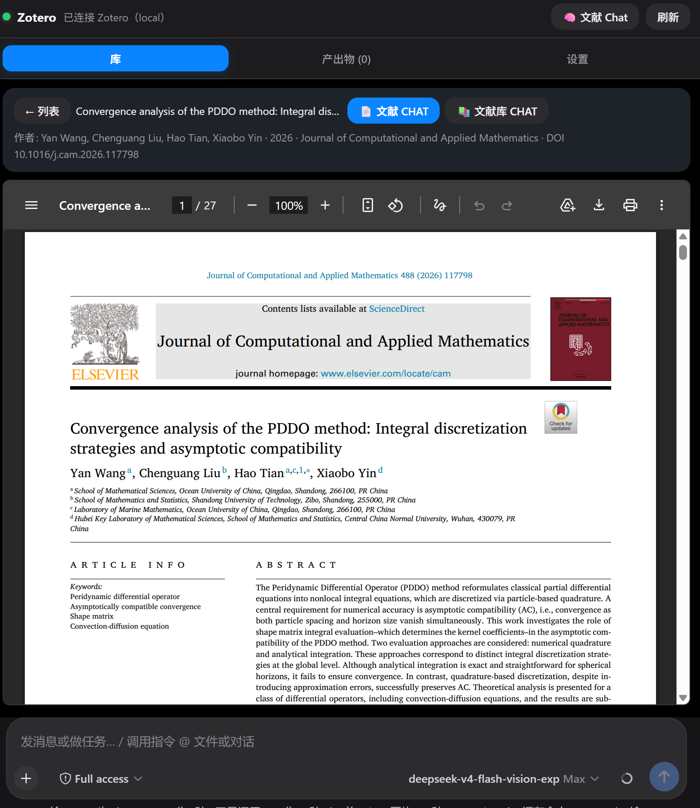
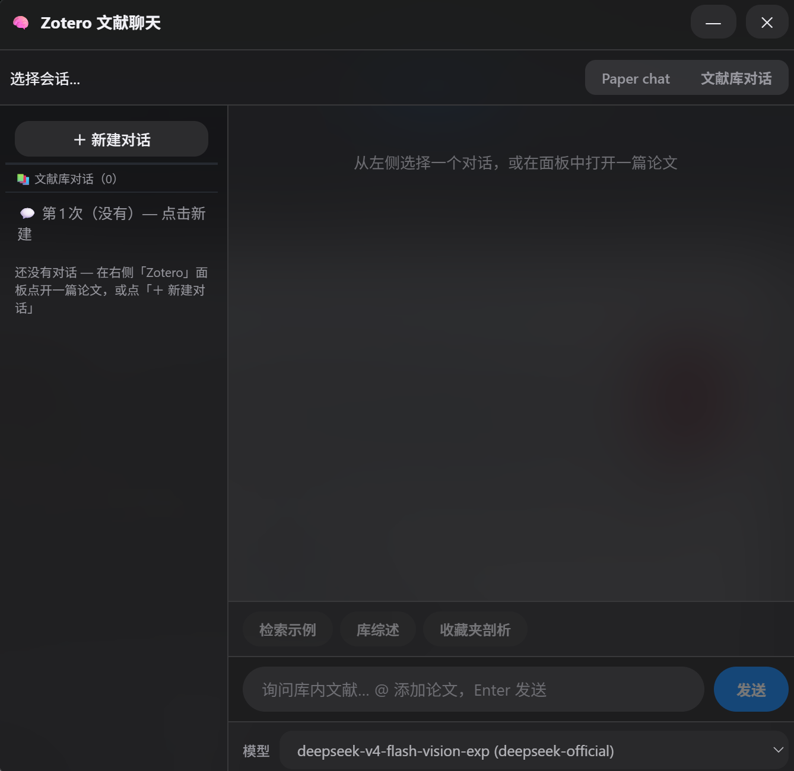

# @dsh-external/dsh-zotero

> 把 Zotero 文献库搬进 DeepSeek Harness 对话侧栏 — 检索即读、PDF 沉浸阅读、划词即译、一键全文翻译、文献级 Chat、MinerU 精读、批量文献分析。

**DSH hybrid 插件**：host（Cordis）直连 **Zotero Local API**（`127.0.0.1:23119`）+ **MinerU**（云端/本地）精读解析 + **pdf2zh** 全文翻译 + DSH 模型适配器；client（React）右侧栏面板 + 独立文献聊天窗。
重构自 [yilewang/llm-for-zotero](https://github.com/yilewang/llm-for-zotero)（AGPL-3.0，出处与审计见 `docs/M0-audit.md`）。

## 界面一览

| 库检索与列表 | 沉浸式 PDF 阅读 | 文献库 Chat 浮窗 |
|---|---|---|
| 点条目即读；收藏夹树 + 全文检索 | pdf.js 自渲染，正文铺满面板 | 逐论文会话 + @引用 + 模型切换 |
|  |  |  |

## 功能亮点

- **📚 库检索/浏览** — Zotero 9+ Local API 直连（Web API 自动降级）；标题/作者/标签/全文（qmode=everything）；收藏夹树 + itemType 过滤 + 分页。
- **📖 PDF 沉浸阅读** — pdf.js 自渲染（懒渲染 + 缩放 + 页码导航），阅读时隐藏 tab/详情行、正文占满；「← 列表」一键返回。
- **🖱 划词即译** — 选中英文即弹「译」浮钮 → 气泡译文；LLM 翻译 + sha1 磁盘缓存 + 论文上下文注入，长文自动分块并发。
- **🌐 一键全文翻译** — pdf2zh 官方 CLI 产出**双语 PDF**（原文+译文同页）与纯译文 PDF，页内 iframe 呈现；另有**左右对照**双文档同步翻页。
- **💬 文献 Chat** — 独立浮动窗：每篇论文一个会话 + 文献库会话；全文注入、`@` 引用其他论文、会话级模型选择器。
- **🔬 MinerU 精读** — cloud v4 / local `:8000`；表格/公式/图高保真；失败自动 pdftotext 降级；面板内**批量解析管理**（队列/进度/清缓存）。
- **📊 文献分析** — 批量概述（2–10 篇）、跨文综述、相关论文推荐（确定性关键词重叠）。
- **⚙️ 设置热生效** — 全部配置面板化，`settings.json` 覆盖层写入即生效，秘钥掩码。

## 工具（11 个）

| 工具 | 说明 |
|---|---|
| `zotero_health` | Local/Web API 健康检测（含 Zotero 9 Local API 开启指引） |
| `zotero_library_search` | 库检索（qmode=everything 全文、tag/collection/itemType 过滤） |
| `zotero_get_item` | 条目详情（元数据 + 附件/笔记/批注 + 文件下载路径） |
| `zotero_collections` | 收藏夹树 |
| `zotero_read_pdf` | PDF → MinerU（cloud/local）→ 缓存；失败自动 pdftotext 降级 |
| `zotero_read_fulltext` | 按章节窗口读取已解析全文 |
| `zotero_summarize` | 概述/定向/深度总结（DSH 模型，prompt 可配置） |
| `zotero_translate` | 文献翻译（text 或全文窗口） |
| `zotero_batch_summarize` | 2–10 篇批量概述 + 跨文对比 |
| `zotero_review` | 跨文综述（谱系/方法族/共识/分歧/空白） |
| `zotero_related` | 相关论文推荐（关键词重叠，零 LLM） |

## 前置依赖

### 必需

| 依赖 | 版本/要求 | 用途 |
|---|---|---|
| **Zotero 桌面端** | 9+（本机 9.0.6 实测） | Local API 数据源；默认关闭，需手动开启 |
| **DSH 运行环境** | 已启用的 DeepSeek Harness Web（含注入器 `dev_*` 工具） | 插件宿主与注入通道 |
| **Node.js** | ≥ 20（本机 v24.17.0 实测） | 构建/运行 |
| **pnpm** | ≥ 9（本机 11.7.0 实测） | 安装依赖 —— ⚠️ 勿用 npm 11（Arborist 崩溃） |
| **bash** | Git Bash（Windows）/ WSL / Linux/macOS 自带 | 运行 `scripts/build.sh` |
| **构建工具链** | 二选一，`build.mjs` 自动探测：<br>① DSH 源码 checkout（`DSH_CHECKOUT` 或 `~/dsh-harness` 等）<br>② installed dsh（npm 全局 `@deepseek-ai/dsh`）+ donor 插件（`~/.dsh/.external-plugins` 下含 typescript+cordis+tsdown 的已注入插件） | host 编译（tsc） |

### 可选（对应功能）

| 依赖 | 安装 | 解锁功能 |
|---|---|---|
| **MinerU 云端** | mineru.net API Key（设置面板填写并「测试连接」） | 高保真全文解析（表格/公式/图） |
| **MinerU 本地** | mineru-api 服务于 `127.0.0.1:8000` | 同上（本机自托管） |
| **pdf2zh**（全文翻译） | `uv tool install --python 3.12 pdf2zh`（Python 3.12，3.13 不兼容） | 一键全文翻译 → 双语 PDF |

> MinerU 不可用时自动降级 pdftotext（需系统有 `pdftotext`，MiKTeX/TeXLive 自带），并显式标注来源。

## 装载指南（构建 → 注入 → 首次使用）

### 1. 获取代码

```bash
git clone https://github.com/Fisfzy/dsh-zotero.git
cd dsh-zotero
```

### 2. 安装依赖

```bash
pnpm install          # 仅 pdfjs-dist（客户端渲染）；npm 11 会崩，务必用 pnpm
```

### 3. 构建 host（Cordis 插件主体）

```bash
bash scripts/build.sh # = node scripts/build.mjs：junction 链接构建依赖 → tsc → lib/
```

自动选择构建模式（见上「构建工具链」），两种模式都不满足时会明确报错并提示缺失项。

### 4. 构建 client（React 面板 bundle）

```bash
npm run build:client  # = tsdown → lib/client.js（单文件 CJS，pdfjs-dist 打进 bundle）
```

### 5. 注入到 DSH

在注入器环境中（dsh-super-injector）：

```
dev_inject_plugin <本插件目录绝对路径>   # 例：D:\AIWORK\...\dsh-zotero
```

注入即完整生效（host + 面板），免重启。后续改代码后重新构建，再 `dev_reload_package` 热重载即可。

### 6. 首次使用

1. **开启 Zotero Local API**：Settings → Advanced → Config Editor → `httpServer.localAPI.enabled = true`（Zotero 9+ 默认关闭）。
2. 打开任一对话页 → 右侧栏出现 **Zotero** tab（绿点 = 已连接）。
3. 点论文进入沉浸 PDF 阅读 / 「文献 CHAT」开聊。
4. **可选**：设置页填 MinerU Key / pdf2zh 参数 → 「测试连接」→ 保存（热生效，免重载）。

### 常见坑

- ⚠️ `pnpm install` 用 npm 11 执行会在 Arborist 崩溃：始终用 pnpm。
- 构建报「installed dsh not found / no donor plugin」：先确认 npm 全局装有 `@deepseek-ai/dsh`，且 `~/.dsh/.external-plugins` 下存在一个已注入插件（提供 typescript+cordis+tsdown）。
- 面板空白/按钮全蓝：DSH GUI 全局 CSS 会污染面板控件，已用 `.dshz[data-dshz-root]` + `!important` 防御；若复现请反馈。
- Zotero 未开启 Local API 时工具报 403：按上「开启 Local API」步骤处理。

## 配置（插件 schema，均可在设置面板改、热生效）

`localApiHost/Port/Key` · `webUserId/webApiKey`（降级）· `searchLimit` · `storageDir`
· `mineruMode/localApiBase/localBackend/cloudApiKey/cloudModel/forceOcr/maxAutoPages`
· `pdf2zhBaseUrl/ApiKey/Model/Threads` · `translateTargetLang` · `fullTextTokenBudget`
· `summaryPrompt/translatePrompt/chatWithPdfPrompt` · `ragEnabled` · `cacheDir`

## 文档

- `docs/PROJECT.md` — 项目介绍（特性/架构/里程碑/迭代）
- `docs/M0-audit.md` — 上游审计与移植决策
- `docs/M1-M2.md` · `docs/M3.md` · `docs/M3.2-chat-window.md` — 里程碑进度

## 许可

本插件 MIT（`LICENSE`）/ BSD-3-Clause（package.json）；重构自 AGPL-3.0 的 llm-for-zotero，保留出处声明。